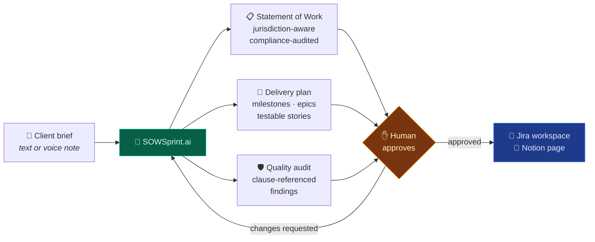
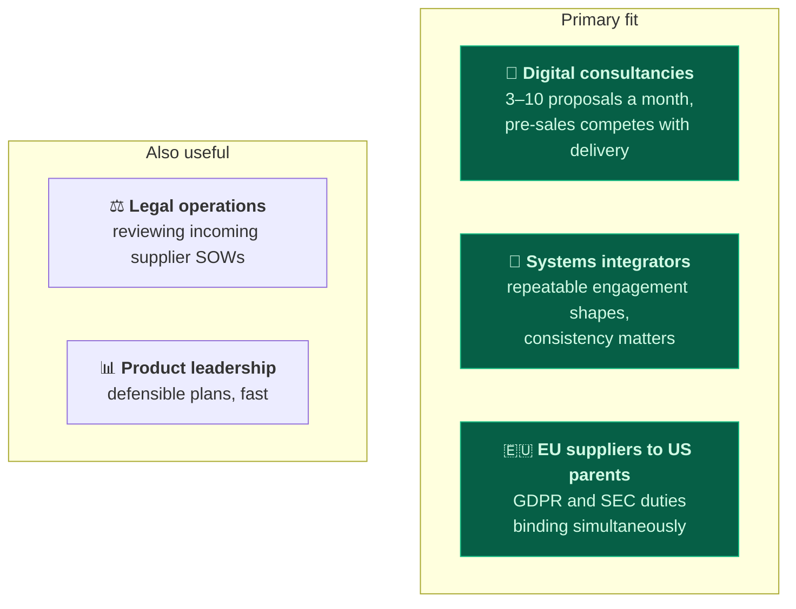
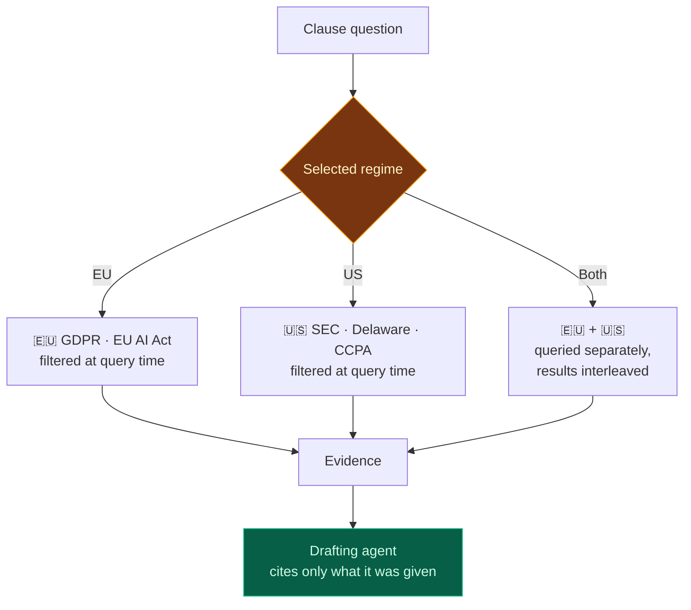
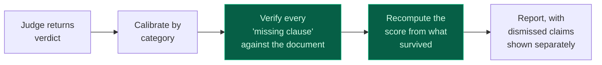

<div align="center">

# SOWSprint.ai

**The three days between a client's brief and a signed Statement of Work, compressed to
three minutes.**

An autonomous multi-agent platform that reads a messy B2B requirement — a paragraph, a
bullet list, a voice note recorded on a phone — and produces an enforceable, jurisdiction-aware
contract together with the delivery plan to execute it.

[](https://github.com/SergeyGer/SOWSprint.ai/actions/workflows/ci.yml)
[](https://github.com/SergeyGer/SOWSprint.ai/actions/workflows/codeql.yml)
[](https://github.com/SergeyGer/SOWSprint.ai/wiki/Testing)
[](https://github.com/SergeyGer/SOWSprint.ai/wiki)
[](LICENSE)

**[📖 Engineering & product wiki →](https://github.com/SergeyGer/SOWSprint.ai/wiki)**


<sub>A complete engagement, sped up. Brief in → agent trace → compliance audit → human
approval → Jira and Notion provisioned → deliverables.</sub>

</div>

---

## The problem

Every B2B engagement begins the same way. A client sends a brief. Someone senior — a
solution architect, a delivery lead, a founder — spends **two to three days** working out
what is actually being asked for and writing it up. Then a delivery manager spends another
day turning it into a plan.

That work is skilled, necessary, and **almost never billed**. It sits in pre-sales.

The expensive part is not the time. It is that this is where ambiguity enters. A Statement of
Work that is silent on data protection, or that caps liability without defining the
carve-outs, does not fail when it is signed. It fails eight months later, in a dispute, when
the person who wrote it has moved to another project.

---

## What SOWSprint.ai does



**Nothing is sent to a client's systems until a person approves it.** The approval screen
lists every planned action — the project key, each epic, each story — before anything
happens.

---

## The impact

| | Industry norm | SOWSprint.ai |
| :-- | :-- | :-- |
| Time to first draft | 1–2 weeks | **90–210 seconds** |
| Senior time per engagement | 20–50 hours | **1–3 hours** (review, not authorship) |
| Cost of the drafting itself | Not separately measured | **$0.05–0.20** |
| Compliance coverage | Depends who reviewed it | Checked against a tagged legal corpus, every time |
| Plan vs contract | Drift apart, written separately | Generated from one source, cannot diverge |

At a blended rate of €80/hour, a single engagement recovers roughly **€1,600–4,000** of
unbilled senior effort. A 12-person consultancy running three engagements a month is looking
at a six-figure annual figure that never appeared on a timesheet.

---

## Who it is for



**[Full business case, including where this is the wrong choice →](https://github.com/SergeyGer/SOWSprint.ai/wiki/Business-Case)**

---

## Compliance is the hard part, and it is solved structurally

A contract bound by both European and American law is the case that breaks template-driven
drafting. A contract satisfying one regime is not a partial success — it is unenforceable in
the other.

SOWSprint.ai enforces the regime **inside the search engine**, not by asking a model nicely:



When both regimes apply, the platform produces **one contract that satisfies both**, with an
explicit rule for what happens when they conflict — because a contract silent on that point
is the trap.

**[How the compliance engine works →](https://github.com/SergeyGer/SOWSprint.ai/wiki/Compliance-RAG)**

---

## The audit does not trust itself

Language models invent defects as confidently as they find them. A judge that reports a
missing clause that is present is worse than no judge: it triggers a rewrite and burns a
reviewer's trust.

Observed live during development: a judge reported **eleven mandatory clauses absent** from a
contract that contained all eleven.



Every guard exists because of a specific failure that actually happened, and each one is
tested. Findings name the clause, the severity and the reasoning — for example:

> **Breach notification (15.1)** — the notification window is defined by reference to runbook
> clause numbering that is not part of the contract. This creates argument over when the
> window starts and what the limit is.

A reader in a hurry would not catch that. The audit did.

**[Quality assurance in depth →](https://github.com/SergeyGer/SOWSprint.ai/wiki/Quality-Assurance)**

---

## See it working

### The approval gate — nothing happens without a human


The 27 planned calls are listed so the reviewer knows exactly what approving means.

### Cost, latency and efficiency, live


Every model call is priced as it happens and attributed to the agent that made it. The audit
costs more than the drafting — deliberately, because a false positive in the audit costs a
full contract rewrite.

### Mobile, because briefs arrive on phones

<p>

</p>

Voice capture, the jurisdiction switch and the full transcript work at 390px wide.

---

## Try it

```bash
git clone https://github.com/SergeyGer/SOWSprint.ai.git
cd SOWSprint.ai

python3 -m venv .venv && .venv/bin/pip install -r requirements-dev.txt

# It runs with no credentials at all — the deterministic engine drives the whole pipeline
.venv/bin/python -m sowsprint.rag.ingest
.venv/bin/python scripts/demo_e2e.py --auto-deploy
```

Deliverables appear in `data/artifacts/<run-id>/`: a Statement of Work as Markdown and PDF, a
delivery backlog, a Jira-importable CSV, the quality audit and a full run report.

**Adding cloud models is an upgrade, not a prerequisite.** One command checks every
configured service and prints the remedy for anything that fails:

```bash
.venv/bin/python scripts/probe_providers.py
```

**[Setup guide for VS Code →](docs/vscode.md)** ·
**[Deployment and operations →](https://github.com/SergeyGer/SOWSprint.ai/wiki/Operations)**

---

## Why this is more than a wrapper around a language model

Four things took real engineering, and each is documented rather than asserted:

| | |
| :-- | :-- |
| **Jurisdiction is enforced in the search engine** | A clause from the wrong regime cannot reach the drafting agent — it fails at query time on both retrieval paths, not in a prompt |
| **The audit verifies itself** | Claims are cross-checked against the document, severity is calibrated by category, and a verdict that came from a fallback is labelled as unreliable |
| **It works with no credentials at all** | The deterministic engine runs the entire pipeline, which is why 483 tests need no network and CI needs no secrets |
| **Nothing is autonomous where it matters** | Dry-run is the default, the approval gate lists every planned call, and the report states plainly what was and was not sent |

---

## Documentation

| | |
| :-- | :-- |
| **[Business case](https://github.com/SergeyGer/SOWSprint.ai/wiki/Business-Case)** | The economics, and where this is the wrong tool |
| **[Who it is for](https://github.com/SergeyGer/SOWSprint.ai/wiki/Who-It-Is-For)** | Five buyer profiles, with the honest answer for each |
| **[Architecture](https://github.com/SergeyGer/SOWSprint.ai/wiki/Architecture)** | System design and the decisions behind it |
| **[Agent pipeline](https://github.com/SergeyGer/SOWSprint.ai/wiki/Agent-Pipeline)** | What each of the eight stages does |
| **[Quality assurance](https://github.com/SergeyGer/SOWSprint.ai/wiki/Quality-Assurance)** | How the audit is kept honest |
| **[Corporate LLM & data residency](https://github.com/SergeyGer/SOWSprint.ai/wiki/Corporate-LLM)** | The on-premise roadmap item that unblocks enterprise adoption |
| **[Roadmap](https://github.com/SergeyGer/SOWSprint.ai/wiki/Roadmap)** | What is next, and what is deliberately not planned |
| **[Cost & observability](https://github.com/SergeyGer/SOWSprint.ai/wiki/Cost-Observability)** | Where the money goes |
| **[Security](https://github.com/SergeyGer/SOWSprint.ai/wiki/Security)** | Threat model, and the gaps |

---

## Honest limitations

Stated here rather than buried, because overclaiming in a legal-adjacent product is how
people get hurt:

- **This is not legal advice.** It drafts and audits against a tagged corpus. It does not
  practise law, and the bundled corpus is not a substitute for counsel.
- **The audit's precision is not yet measured.** The guards are tested; the judge's accuracy
  against a labelled set is not. A published evaluation is the next major item on the
  roadmap.
- **The EU corpus is regulatory text, not precedent clauses.** No public dataset of EU
  contract clause language exists. US commercial clauses come from CUAD; EU material is
  GDPR, the AI Act and guidance, from which clauses are authored rather than retrieved.
- **No TLS, no role separation, in-memory sessions.** Fine for a LAN pilot, not for a shared
  deployment. → [Security](https://github.com/SergeyGer/SOWSprint.ai/wiki/Security)

---

## Project

Built with LangGraph, Chainlit, Qdrant and Docker · **483 tests** · MIT licensed

<sub>The bundled compliance corpus is an adaptation of CUAD (CC BY 4.0) and Pile of Law, with
hand-authored material. It is a demonstration corpus, not a legal reference.</sub>
