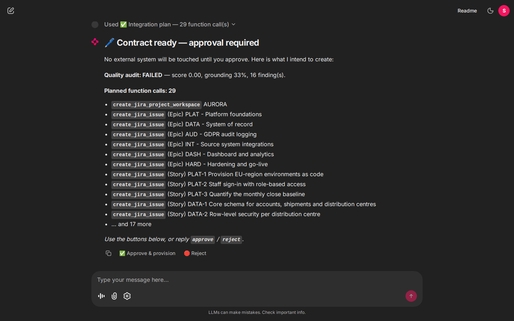
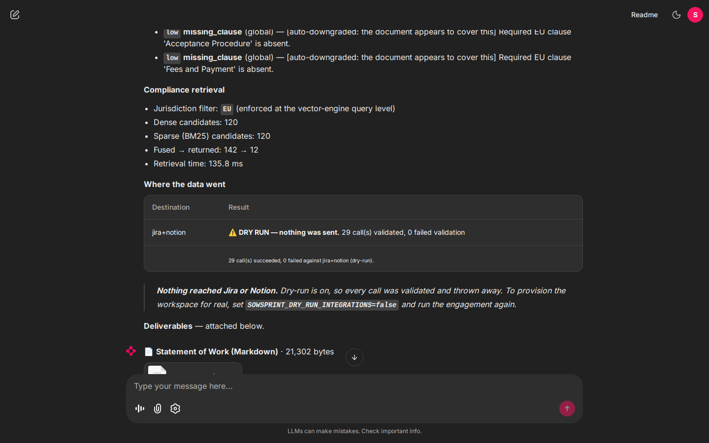
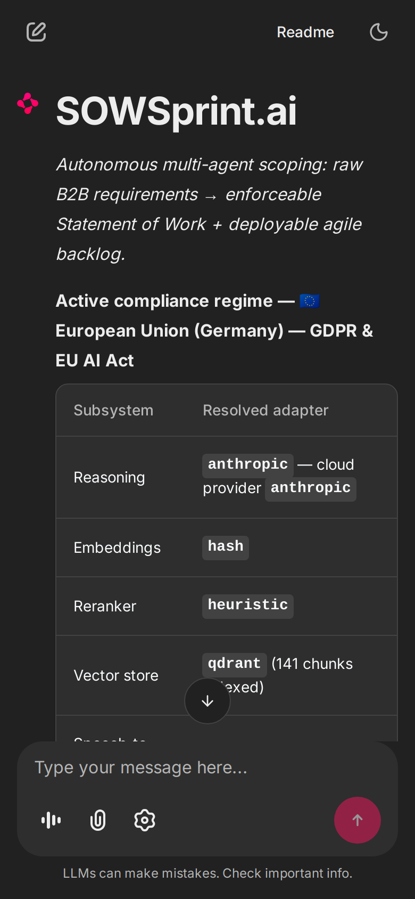

<div align="center">

# SOWSprint.ai

**Autonomous multi-agent AI platform that turns chaotic B2B requirements into
enterprise-grade Statements of Work and instantly deployable project workflows.**

[](https://github.com/SergeyGer/SOWSprint.ai/actions/workflows/ci.yml)
[](https://github.com/SergeyGer/SOWSprint.ai/actions/workflows/codeql.yml)
[](https://www.python.org/downloads/)
[](#verification)
[](https://github.com/astral-sh/ruff)
[](LICENSE)
[](#quick-start)

`LangGraph` · `Chainlit` · `Qdrant` · `Docker` · `Python 3.11`

*Scoping-to-contract lifecycle: **3 days → 5 minutes.***



<sub>The agent trace, a passing quality audit, and the 27 integration calls planned for approval — from a live run.</sub>

</div>

---

## What this is

A client sends a messy brief — a paragraph, a bullet list, a voice note recorded on a
phone. Five minutes later they have a jurisdiction-aware Statement of Work, a
milestone/epic/story backlog with testable acceptance criteria, a quality-audit report,
and a provisioned Jira workspace — with a live meter of what the whole thing cost.

Four LLM personas run as a **cyclic state graph**, not a chain. When the Critic rejects a
contract it goes back to the drafting agent. When the brief is missing something
critical, the graph *stops* and asks exactly three questions instead of inventing an
answer.

```
Triage ──(INCOMPLETE)──► Clarify ⟲  (3 questions, human-in-the-loop)
   │
   └──(COMPLETE)──► Architect ──► Legal/SOW ◄──┐
                                     │         │
                                     ▼         │ (failed audit)
                                  Critic ──────┘
                                     │ (passed)
                                     ▼
                              Approval gate ⟲  (human-in-the-loop)
                                     │
                                     ▼
                          Jira/Notion ──► SOW PDF + backlog + cost report
```

---

## Quick start

### Zero credentials required

The default configuration runs the **entire pipeline on deterministic local engines** —
heuristic reasoning, hashing embeddings, in-process vector store, dry-run integrations.
No API keys, no network calls. Add credentials later to upgrade quality; nothing is
gated behind them.

```bash
git clone <repo> && cd SOWSprint
make install
make demo          # full pipeline, headless, ~15 seconds
```

```bash
make dev           # Chainlit UI at http://localhost:8000
```

### With Docker (app + Qdrant)

```bash
cp .env.example .env
make up            # builds and starts both containers
make ps            # health status
```

### Mobile testing over Wi-Fi

The brief requires testing on a real iPhone. The application binds `0.0.0.0` inside the
container and the published port is bound on all host interfaces:

```bash
make lan-ip        # prints http://<your-lan-ip>:8000
```

Open that URL in Safari on a phone on the same Wi-Fi. The microphone button in the
composer records audio, which is transcribed and fed straight into Triage.

> **If port 8000 is already in use**, set `SOWSPRINT_HOST_PORT` in `.env`. The
> container-internal port stays 8000; only the host mapping changes.

---

## See it working


<sub>A complete engagement, sped up: brief in → agent trace → quality audit → approval → provisioning → deliverables. Recorded from a real run at <a href="scripts/capture_demo.py">scripts/capture_demo.py</a>.</sub>

### The agent trace and the approval gate


Nothing touches Jira or Notion until a human approves. The 27 planned calls are listed
so the reviewer knows exactly what approving means.

### Cost, latency and prompt-cache telemetry



Every LLM call is priced as it happens: spend against budget, the token split, a
per-agent cost breakdown, and how much the prompt cache avoided spending. Note
`CACHE HIT 2.6k −$0.000233` — the static persona and JSON-schema prefix is served from
cache on repeat calls.

### The quality audit, in detail


Findings name the clause, the severity and the reasoning — a breach-notification window
that references runbook clause numbers absent from the SOW, a retention period resting
on an unconfirmed assumption, a liability carve-out whose scope is ambiguous.

### Mobile, because briefs arrive on phones

<p>

</p>

Voice capture, the jurisdiction switch and the full transcript all work at 390px wide.
The stack binds `0.0.0.0`, so a phone on the same Wi-Fi reaches it directly.


---

## What you get

| Deliverable | Format | Produced by |
| :-- | :-- | :-- |
| Statement of Work | PDF (signature-ready) + Markdown | `export/sow_pdf.py`, `sow_markdown.py` |
| Agile backlog | Markdown + JSON | `export/sow_markdown.py` |
| Jira import file | CSV matching Jira's import mapper | `export/jira_csv.py` |
| Quality audit report | Markdown | `export/sow_markdown.py` |
| Run report | JSON (scope, blueprint, audit, integrations, cost) | `export/bundle.py` |
| Jira / Notion workspace | Live REST or validated dry-run payloads | `tools/` |

---

## Feature deep-dives

### 1. Agentic orchestration with bounded cycles

The graph (`src/sowsprint/agents/graph.py`) is compiled by LangGraph with a checkpointer
and two `interrupt()` points. Three properties make it production-safe rather than a
demo:

**Cycles are bounded structurally.** The quality-repair loop consults
`critique_attempts` against `max_critic_retries`; the clarification loop consults
`triage_rounds` against `MAX_CLARIFICATION_ROUNDS`. Neither can spin.

**Analysis is separated from interruption.** LangGraph re-executes a node from the top
when it resumes after an interrupt — so any LLM call placed *before* an `interrupt()`
would be billed twice. Triage (analyse) and Clarify (ask) are therefore separate nodes,
which is what makes the human-in-the-loop cycle cost-correct rather than merely
functional. There is a regression test for exactly this
(`test_clarification_does_not_rebill_the_triage_node`).

**Failure is declarative.** A budget overrun or provider error sets a terminal status;
every routing function checks it and diverts to `END`, instead of exception handlers
scattered through the graph.

### 2. Compliance-aware Advanced RAG — EU, US, or both at once

Three regimes are selectable from the UI, and the choice is not a prompt hint. It is a
**metadata filter pushed into the vector engine on both retrieval arms**, so a clause
from an unselected regime can never reach the candidate pool:

```python
# src/sowsprint/rag/schema.py
Filter(must=[FieldCondition(key="jurisdiction", match=MatchValue(value="EU"))])
```

Pipeline: `dense (cosine) ∥ sparse (BM25) → RRF fusion → cross-encoder rerank → top-k`

| Stage | Implementation | Why |
| :-- | :-- | :-- |
| Chunking | Clause-boundary aware, sentence packing fallback | A liability cap severed from its proviso is worse than useless |
| Dense | Qdrant named vectors, cosine | Semantic recall across paraphrased legal language |
| Sparse | **BM25 implemented in-house** with a hashed vocabulary (`zlib.crc32`, not `hash()`) | Stable across processes without shipping a vocabulary file |
| Fusion | Reciprocal Rank Fusion, k=60 | Cosine ∈ [-1,1] and BM25 is unbounded; RRF fuses *ranks*, so no score calibration is needed |
| Rerank | Heuristic cross-encoder surrogate offline; BGE via TEI or Cohere when configured | Fusion optimises recall; reranking optimises the finite context budget |
| Multi-topic | One query per clause topic, excluding already-seen chunks | A single blended query lets GDPR passages crowd out the liability cap |
| Dual regime | Every topic run against **both** regimes, results interleaved | A blended query is regime-skewed, and the skew is invisible — the contract just omits the quieter regime |

**Dual-regime contracts (EU + US).** A US parent processing EU personal data is bound by
GDPR *and* SEC disclosure duties at once. Selecting **BOTH** produces a single contract
that satisfies both, adding three clauses that only exist when the regimes meet:

| Clause | Purpose |
| :-- | :-- |
| Dual-Regime Compliance and Order of Precedence | How the two obligation sets coexist, and who owns compliance for each |
| Cross-Border Data Transfers and Transfer Mechanisms | Adequacy, SCCs, the EU-U.S. Data Privacy Framework, transfer impact assessments |
| Conflicting Obligations and Stricter-Standard Rule | The resolution rule, with a worked example (breach-notification timing) |

Conflicts are resolved by an explicit **stricter-standard rule** rather than by silently
choosing a side — an unstated resolution rule is exactly the gap that becomes a dispute.
Evidence is drawn from each selected regime in equal measure: a dual run returns 6 EU +
6 US passages, verified by test.

Corpus: **69 entries → 141 chunks (70 EU / 71 US)**, adapted from the Atticus Project
CUAD categories and the Pile of Law, covering GDPR, the EU AI Act, CCPA/CPRA, HIPAA,
PCI DSS, SOX, SEC disclosure, Delaware DGCL, and the commercial clauses in between.

### 3. Mobile-first UI with native voice

`Chainlit` renders the whole experience; `public/custom.css` tightens it for iOS Safari
(44 px touch targets, 16 px inputs to prevent zoom-on-focus, scrollable tables).

The capture widget streams **headerless 16-bit PCM**, so the pipeline wraps it in a
proper RIFF/WAVE container before it goes anywhere — writing bare samples to
`recording.wav` produces a file every speech-to-text API rejects with an opaque 400.
Uploaded recordings (`.m4a` from iOS Safari, `.webm` from Chrome) are passed through
untouched, which keeps ffmpeg out of the image.

Three transcription targets, resolved in this order:

| Target | When | Why |
| :-- | :-- | :-- |
| **Self-hosted** (`SOWSPRINT_WHISPER_BASE_URL`) | any OpenAI-compatible server | A dictated requirement is often the most confidential artefact in the flow; this keeps it on your network |
| **Groq** `whisper-large-v3-turbo` | Groq key present | Lowest-latency hosted option — the difference between voice scoping feeling instant and broken |
| **OpenAI** `whisper-1` | OpenAI key present | Sensible default |
| *nothing configured* | — | Fails **honestly** with instructions, rather than pretending to have heard something |

With no provider the pipeline reports exactly what is missing and scopes nothing. It
never silently drops a requirement.

`scripts/whisper_stub.py` is a test double for the self-hosted contract. It is
deliberately not a yes-man: it validates the upload and returns a 400 for headerless
PCM, which is how a real server behaves — making it a regression test for the capture
pipeline rather than a rubber stamp.

### 4. Contract revision — targeted edits, not rewrites

A B2B contract is negotiated, not accepted. The revision workflow lets a reviewer change
what they want and nothing else:

| Command | Effect |
| :-- | :-- |
| `/revise make the liability cap mutual` | Changes only the clauses that instruction touches |
| `/lock 6 7` | Freezes agreed clauses |
| `/diff` | Shows what moved and what was held |
| `/clauses` | Lists clauses with their lock state |

At the approval gate, any message that is not `approve`/`reject` is read as a change
request — the natural moment to negotiate, because the reviewer is looking at the
contract.

**The lock guarantee is enforced in code, not requested of the model.** After a
revision returns, every locked clause is restored verbatim from the previous version;
a locked clause the model dropped is re-inserted. Asking a model to leave agreed text
alone works most of the time — restoring it in code works every time, and a silently
altered liability clause is not a defect anyone forgives.

Measured against a deliberately hostile instruction (*"rewrite the entire agreement and
make the liability unlimited"*) on a 14-clause contract with one clause locked:
**1 clause modified, 12 unchanged, 1 locked and preserved byte-identical**. A full
redraft costs ~$0.02–0.07 and loses negotiation history; a revision costs one call.

### 5. AI financial observability

Every LLM call routes through `telemetry/tracker.py`, which prices it against a
per-million-token book and updates a per-session ledger. **Prompt caching** is enabled
at the provider level: the persona plus JSON schema prefix is marked as an ephemeral
cache breakpoint, so a repeat call reuses it at a fraction of the input rate. Measured:
4,071 tokens written on the first call, read back on the second for $0.0042 less, with
the saving shown on the dashboard as a distinct tile. The UI renders a **sticky
custom element** (`public/elements/CostDashboard.jsx`) showing live spend, budget
consumption, token split, call count and a per-agent cost breakdown.

The graph enforces a hard session budget and halts rather than overshooting it. When
running on the offline engine, calls consume no billable tokens; the dashboard applies a
**shadow price** and labels the figure `simulated` so it can never be mistaken for an
invoice.

### 5. External tool automation via function calling

The approved blueprint and the registry's JSON function schemas are handed to the model,
which returns a validated `ToolCallPlan`. Two safety properties: the plan is schema-
validated *before* anything executes, and hallucinated tool names are dropped before
they reach the executor. Payloads are built identically in both modes, so **dry-run** is
a genuine review tool rather than a stub.

---

## Engineering decisions worth flagging

**Offline-first is a design constraint, not a fallback.** The deterministic engine
(`llm/offline.py`) is a real rule-based implementation — lexicon extraction, phase
planning, jurisdiction-parameterised clause assembly, and a rule-based auditor. It makes
the whole system reproducible in CI with no network, and it is the CPU-only instance of
the "local guardrail" tier the brief calls for. Both backends read the *same* tagged
prompt blocks, so switching providers changes answer quality but never control flow.

**Telemetry never breaks a run.** Pricing failures, unknown models and provider errors
inside the accounting layer are swallowed; a missing price yields zero cost, not an
exception.

**The Critic's most important check is citation existence.** Inventing a citation is the
single most dangerous failure mode in the pipeline, so the Legal agent may cite only ids
literally present in the evidence block, and the Critic independently verifies every one
against the corpus.

**`unsafe_allow_html` stays off.** The UI renders model-generated contract text; allowing
raw HTML would turn a prompt-injection attempt in a customer brief into stored XSS. All
chat rendering is therefore pure Markdown.

---

## Project structure

```
SOWSprint/
├── app.py                      Chainlit entry point (presentation only)
├── Dockerfile                  Multi-stage, python:3.11-slim, non-root
├── docker-compose.yml          sowsprint-app + sowsprint-qdrant
├── public/
│   ├── custom.css              Mobile-first presentation layer
│   └── elements/CostDashboard.jsx   Sticky cost widget
└── src/sowsprint/
    ├── config.py               Pydantic settings; every adapter is optional
    ├── models.py               Domain contract (graph state + LLM schemas + UI model)
    ├── agents/
    │   ├── graph.py            LangGraph topology and routing table
    │   ├── nodes.py            Node implementations (halt-aware, telemetry-emitting)
    │   ├── prompts.py          Persona prompts + tagged context blocks
    │   ├── runtime.py          ScopingSession façade (sync + streaming)
    │   └── state.py            GraphState TypedDict with reducers
    ├── rag/
    │   ├── chunking.py         Legal-aware chunker + in-house BM25
    │   ├── schema.py           Payload contract + metadata filter
    │   ├── store.py            Qdrant + in-memory backends (identical semantics)
    │   ├── fusion.py           Reciprocal Rank Fusion
    │   ├── rerank.py           Heuristic / TEI / Cohere cross-encoders
    │   ├── retriever.py        Orchestrator (multi-topic, filtered, reranked)
    │   ├── pipeline.py         Process-wide singleton
    │   └── corpus_data.py      69-entry compliance corpus
    ├── llm/
    │   ├── base.py             Client contract + telemetry + retry + validation
    │   ├── offline.py          Deterministic engine (local guardrail)
    │   ├── nlp.py              Rule-based requirement analysis
    │   ├── openai_client.py    OpenAI + Groq + Ollama (one contract)
    │   ├── anthropic_client.py Claude
    │   └── factory.py          Tier routing + graceful degradation
    ├── telemetry/              Price book, ledger, dashboard rendering
    ├── tools/                  Registry, Jira, Notion, planner, executor
    ├── voice/                  Whisper pipeline with honest offline degradation
    ├── export/                 SOW PDF/Markdown, Jira CSV, bundle assembly
    └── observability/          Structured JSON logging with run correlation
```

---

## Verification

Everything below was executed against this codebase, not asserted.

| Suite | Result |
| :-- | :-- |
| `tests/test_nlp.py` | 65 passed |
| `tests/test_offline_engine.py` | 42 passed |
| `tests/test_rag_chunking.py` | 31 passed |
| `tests/test_rag_retrieval.py` | 48 passed |
| `tests/test_agents_graph.py` | 39 passed |
| `tests/test_jurisdiction.py` | 27 passed |
| `tests/test_revision.py` | 18 passed |
| `tests/test_voice_capture.py` | 21 passed |
| `tests/test_tools.py` · `test_export.py` · `test_voice.py` · `test_config_models.py` | 105 passed |
| **Total** | **426 passed** |
| **Live UI harness** (`scripts/verify_ui.py`) | **12/12 checks passed** |
| **Live voice harness** (`scripts/verify_voice.py`) | **8/8 checks passed** |

Two harnesses drive the *running Chainlit server over its real socket.io protocol* —
the same wire format the browser uses:

* `verify_ui.py` asserts the full conversation: welcome → requirement → clarification →
  approval → provisioning → deliverables.
* `verify_voice.py` streams synthesized PCM through `audio_start` / `audio_chunk` /
  `audio_end` and asserts the transcript reaches Triage and produces a Statement of Work.

The voice harness exists because the unit tests passed while the feature was **broken in
production**: Chainlit 2.x invokes `on_audio_end()` with no arguments, so a handler
declaring a parameter raised `TypeError` on every microphone release. Only an
end-to-end run catches that class of defect.

Measured end-to-end on the EU sample brief:

```
69 corpus entries → 141 chunks (70 EU / 71 US) indexed in 187 ms
Triage    COMPLETE, confidence 98%, 3 compliance triggers
Architect 4 milestones · 16 user stories · 52 story points
Legal     14 clauses · 977 words · 8 evidence links
Retrieval 140 fused → 12 passages, jurisdiction=EU filter enforced
Critic    PASSED · score 1.00 · grounding 73% · 0 findings
Tools     23 function calls, 0 failures (Jira + Notion, dry-run)
Export    7 artefacts incl. a 12 KB PDF
Cost      ~$0.28 simulated · ~64k tokens · 5 calls · 11% of budget
```

Voice path (against the bundled self-hosted test double):

```
96,000 bytes of headerless PCM streamed in 3 chunks
-> wrapped in a RIFF/WAVE container, posted to the self-hosted endpoint
-> transcript returned, 8/8 voice checks passed, SOW produced
```

```bash
make test          # unit + integration + e2e
make verify-ui     # drive the live UI over socket.io
make verify-voice  # stream PCM through the audio hooks and assert a transcript lands
make health        # container liveness + readiness (incl. jurisdiction filter probe)
```

---

### Verifying what a browser actually renders

`verify_ui.py` drives socket.io and asserts on message payloads. That is useful, but it
cannot tell whether anything was drawn: the cost dashboard passed every payload check
while being completely invisible, because the server emitted a Chainlit `CustomElement`
with correct props and the frontend silently failed to mount it.

`scripts/verify_visual.py` runs a real Chromium and asserts on the DOM instead:

```bash
docker run --rm --network sowsprint_sowsprint-net \
  -e PLAYWRIGHT_BROWSERS_PATH=/ms-playwright \
  -v "$PWD/scripts:/scripts:ro" \
  --entrypoint bash mcr.microsoft.com/playwright/python:v1.49.1-noble \
  -c "pip install -q playwright==1.49.1; python /scripts/verify_visual.py"
```

It checks that React mounts, that the composer is interactive, that a full engagement
reaches the approval gate, that the dashboard markup is in the DOM **with a real layout
box**, and that no console errors appeared. Running it is what found the missing
dashboard, and it is the check that would have caught it months earlier.

---

## Authentication

**On by default.** The application spends real money on model calls and writes to Jira
and Notion, and it binds `0.0.0.0` so a phone on the same Wi-Fi can reach it — which
also means anything else on that network can. An open deployment is an explicit
decision, not an inherited default.

```bash
# Create a human account (prompts for the password; --password leaves it in history)
python -m sowsprint.security.passwd --user alice --json

# Create a machine account for the verification harnesses and CI
python -m sowsprint.security.passwd --api-key ci

# Chainlit signs session cookies with this
chainlit create-secret
```

Put the results in `.env` as `SOWSPRINT_AUTH_USERS`, `SOWSPRINT_AUTH_API_KEYS` and
`CHAINLIT_AUTH_SECRET`. A misconfigured deployment **fails at startup** rather than
serving an open application the operator believes is locked.

| Path | Used by | Mechanism |
| :-- | :-- | :-- |
| `POST /login` | people | username + password against an scrypt digest |
| `POST /auth/header` | scripts, CI | `X-API-Key`, exchanged for a short-lived cookie |

### Design notes

**Passwords use `hashlib.scrypt`** from the standard library rather than bcrypt or
argon2, so the image carries no native build dependency. The stored format is
self-describing, so cost parameters can be raised later without invalidating digests.

**The digest separator is a dot, not a dollar sign.** This is not a style choice.
Digests live in `.env`, which Docker Compose reads with variable interpolation:
`scrypt$16384$8$1$…` arrives inside the container as `scrypt`, because Compose reads
`$16384` as an unset variable and substitutes nothing. Every login then fails with a
*correct* password, and the only signal is a warning about an unset variable that
scrolls past. This shipped once during development; there is now a test asserting the
digest contains no `$`, and the parser rejects the dollar form with a message that
names the trap.

**Failed logins are throttled** per identity, and every failure path performs a hash
anyway so response timing does not reveal whether a username exists.

**Sessions are namespaced per account**, so two people sharing a deployment cannot read
each other's transcripts or cost ledgers, and a budget applies per person.


---

## Configuration

Everything is a `SOWSPRINT_*` environment variable; see [`.env.example`](.env.example)
for the annotated list. The ones that matter most:

| Variable | Default | Effect |
| :-- | :-- | :-- |
| `SOWSPRINT_LLM_PROVIDER` | `auto` | `auto` picks the best credentialed provider, else offline |
| `SOWSPRINT_VECTOR_BACKEND` | `qdrant` | `auto` degrades to in-process memory if Qdrant is down |
| `SOWSPRINT_CRITIC_MODEL` | `gpt-4o` | Point at a **different vendor** for genuine judge independence |
| `SOWSPRINT_SESSION_BUDGET_USD` | `2.50` | Hard ceiling; the graph halts rather than exceed it |
| `SOWSPRINT_MAX_CRITIC_RETRIES` | `1` | Bounds the quality-repair cycle |
| `SOWSPRINT_DRY_RUN_INTEGRATIONS` | `true` | Validate Jira/Notion payloads without sending them |
| `SOWSPRINT_HOST_PORT` | `8000` | Host-side port for Docker; container port stays 8000 |
| `SOWSPRINT_WHISPER_BASE_URL` | *(unset)* | Self-hosted Whisper; when set it **wins** over cloud keys so audio never leaves your network |

---

## Limitations and roadmap

Honest about what this is not:

* **The offline engine is rule-based, not semantic.** It produces genuinely useful,
  internally consistent contracts, but a cloud model drafts materially better prose.
  The offline path exists for reproducibility and as a guardrail tier.
* **The bundled corpus is an adaptation** of CUAD/Pile-of-Law subject matter, written for
  demonstration. It is not legal advice and does not replace counsel review.
* **No authentication.** Chainlit ships without an auth callback here; put it behind a
  reverse proxy or add `@cl.password_auth_callback` before exposing it beyond a LAN.
* **`MemorySaver` checkpoints are per-process.** Swap in `SqliteSaver`/`PostgresSaver`
  for multi-replica deployments — the graph topology does not change.
* **The heuristic reranker is a surrogate**, not a trained cross-encoder. Point
  `SOWSPRINT_TEI_RERANK_URL` at a BGE reranker for the real thing.

Roadmap: an evaluation harness scoring generated SOWs against a golden set; SSE streaming
of token-level output; a Postgres checkpointer; multi-tenant corpus isolation.

---

## License

MIT. See [LICENSE](LICENSE).

<div align="center">
<sub>Built to demonstrate production-grade agentic orchestration, compliance-aware
retrieval, containerised infrastructure and AI financial observability.</sub>
</div>
