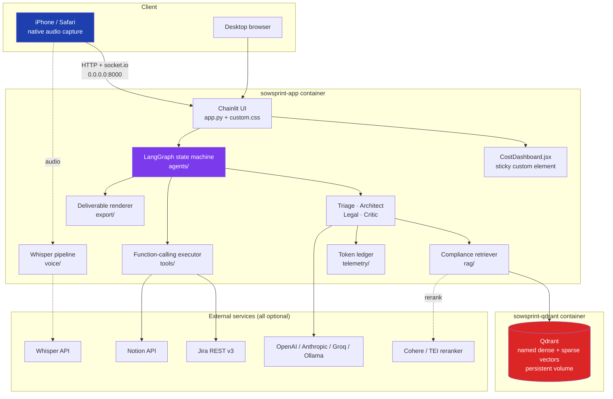
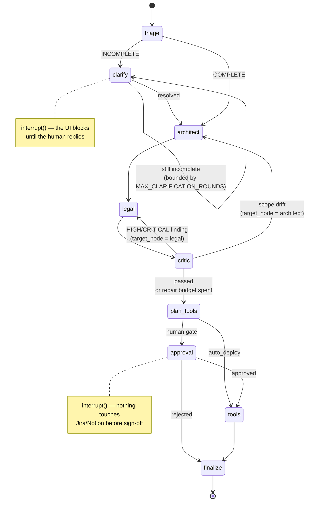
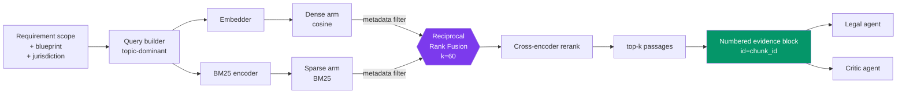

# Architecture

## 1. System context



## 2. The state graph



### Why the cycles are safe

| Cycle | Bound | Where enforced |
| :-- | :-- | :-- |
| `triage → clarify → clarify` | `MAX_CLARIFICATION_ROUNDS = 3`, then residual gaps become documented assumptions | `agents/nodes.py::AgentNodes.clarify` |
| `critic → legal/architect` | `settings.max_critic_retries`, then residual findings are reported and the run advances | `agents/nodes.py::make_routers.after_critic` |
| LangGraph recursion | `recursion_limit: 60` in the run config | `agents/runtime.py` |

A permanently failing audit therefore terminates and *reports its findings*, rather than
looping until the budget dies. There is a test for this
(`test_loop_terminates_when_repairs_never_succeed`).

## 3. Node contract

Every node is `GraphState -> partial update`. The uniform shape is deliberate:

```python
def some_node(self, state: GraphState) -> dict[str, Any]:
    if self._halted(state):          # a prior node already failed
        return {}
    try:
        response = self.client.complete(..., node="...", tier=self.router.tier_for("..."))
    except (BudgetExceededError, LLMError) as exc:
        return self._halt(state, exc, "...")   # sets a terminal status

    model = response.parsed                    # already schema-validated
    return {
        "artifact": model.model_dump(mode="json"),
        "stage": Stage.X.value,
        "events": [ _event(...) ],             # appended via the `operator.add` reducer
        "cost": _cost_snapshot(self.session_id),
    }
```

Three consequences worth noting:

* **Nodes never raise.** Failure becomes state, and routing functions divert to `END`.
* **Everything crossing a boundary is JSON.** Models are dumped on write and re-validated
  on read, so checkpoints stay portable across `MemorySaver`, SQLite and Postgres.
* **Telemetry is a first-class output**, not a side effect — the UI renders the run trace
  straight from `state["events"]`.

## 4. Retrieval pipeline



The metadata filter is applied **inside both arms** at the database query level:

```python
Filter(must=[FieldCondition(key="jurisdiction", match=MatchValue(value="EU"))])
```

`InMemoryStore` mirrors the semantics exactly via `schema.matches_filter`, and
`test_jurisdiction_filter_excludes_the_other_regime` asserts the property from both
directions so the fallback backend can never silently diverge.

**Citation identity.** Retrieved passages are rendered as
`[n] <citation> (jurisdiction=EU) id=<chunk_id>`. The Legal agent may cite only ids
present in that block; the Critic independently checks every citation against the corpus
and raises a `CRITICAL` hallucination finding for any id it cannot resolve. The two
agents share no other state.

## 5. Degradation ladder

Every subsystem resolves independently. Nothing is all-or-nothing.

| Subsystem | Preferred | Fallback 1 | Fallback 2 |
| :-- | :-- | :-- | :-- |
| Reasoning | Anthropic / OpenAI / Groq | Ollama (self-hosted) | Deterministic offline engine |
| Embeddings | OpenAI `text-embedding-3-*` | Ollama | Signed feature hashing |
| Reranking | BGE via TEI | Cohere | Heuristic cross-encoder surrogate |
| Vector store | Qdrant | — | In-process `InMemoryStore` |
| Speech-to-text | Groq `whisper-large-v3-turbo` | OpenAI `whisper-1` | Honest failure + sidecar transcript |
| Integrations | Live Jira/Notion REST | Validated dry-run payloads | — |

Cloud reasoning is additionally wrapped in `FallbackLLMClient`, which degrades a single
call to the offline engine on provider failure. Budget exhaustion is explicitly **not**
treated as a failure and is propagated so the graph halts deliberately instead of
producing an ungrounded contract.

## 6. Data model

`src/sowsprint/models.py` serves three roles at once, which is why it is the most
load-bearing module:

1. **Graph state contract** — what flows between nodes.
2. **LLM structured-output schema** — `model_json_schema()` is injected into every prompt
   and the response is validated before it can reach a downstream node.
3. **UI rendering model** — Chainlit renders from these objects, so the presentation
   layer never parses free text.

Key types: `RequirementScope` → `TechnicalBlueprint` → `SOWDocument` → `CritiqueReport`,
plus `TokenUsage`/`CostReport` for telemetry and `RetrievedChunk` for evidence.

## 7. Container topology

```
host 0.0.0.0:${SOWSPRINT_HOST_PORT:-8000}
        │
        ▼
┌───────────────────────────────────────────┐  sowsprint-net (bridge)
│ sowsprint-app  (python:3.11-slim, non-root)│
│   chainlit --host 0.0.0.0 --port 8000     │
│   PYTHONPATH=/app/src                     │
│   volume: artifact_data → /app/data/artifacts
└───────────────┬───────────────────────────┘
                │ http://sowsprint-qdrant:6333
                ▼
┌───────────────────────────────────────────┐
│ sowsprint-qdrant (qdrant/qdrant:v1.12.4)  │
│   volume: qdrant_storage → /qdrant/storage│
└───────────────────────────────────────────┘
```

`depends_on: condition: service_healthy` plus a TCP-probe healthcheck on Qdrant means
the app never starts against a vector database that is still booting.

## 8. Observability

Structured JSON logs carry a `run_id` context variable bound at session start, so one
scoping engagement can be traced across every node and both containers. The financial
layer is separate from the log layer by design: logs answer *what happened*, the ledger
answers *what it cost*, and the two are correlated by `run_id`.
